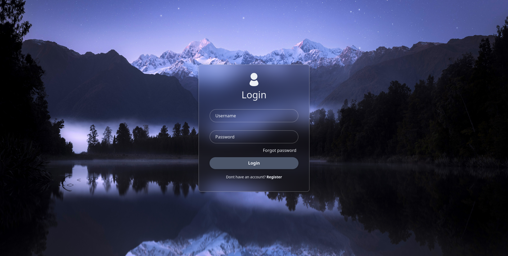

# Calendify
A secure calendar web-app made for companies that want to organize their meetings and motivate their employees.

Made using React, ASP .NET Core and .NET EntityFramework Core.
# Showcase

# Features
This application features a robust login and registration system and a dashboard to view upcoming events in a calendar view.
# Project structure
The project is split into two components: `Backend` and `Frontend`.
## Frontend
`Frontend` is made with React, utilizing React Router and CSS modules to create a seamless end-user experience.
## Backend
`Backend` is an API made with ASP .NET Core, using a SQLite database managed by .NET EntityFramework Core.

It features authorization endpoints which utilize JWT tokens and cycling refresh tokens to securely authorize users wanting to access protected information.

# Development instructions
## Creating a new migration
In the `Backend` directory, run the following command
```bash
dotnet ef migrations add "MigrationName"
```
This needs to be done everytime a model structure is edited, a model is added or deleted, etc. Whenever the database structure needs changing.
## Updating the database to the latest migration
In the `Backend` directory, run the following command
```bash
dotnet ef database update
```

# Run instructions
First, clone the repository and change into the cloned directory.
```bash
git clone https://github.com/333suki/Calendify
```
```bash
cd Calendify
```
This directory has two main subdirectories, `Backend` and `Frontend`. These are the root directories to run the backend and frontend, both should be running at the same time in order for the application to work as intended.
## Run backend
First, change directory into the `Backend` directory.
```bash
cd Backend
```
Then install all the required Nuget packages.
```bash
dotnet restore
```
Finally, run the backend.
```bash
dotnet run
```
## Run frontend
First, change into the `Frontend` directory.
```bash
cd Frontend
```
Then install all the required npm packages
```bash
npm install
```
Finally, run the frontend.
```bash
npm run dev
```
The frontend will by default run on http://localhost:5173/. This may be different for you, so check the `npm run dev` command output to see which URL was chosen. Visit this URL in your browser to access the login page.
